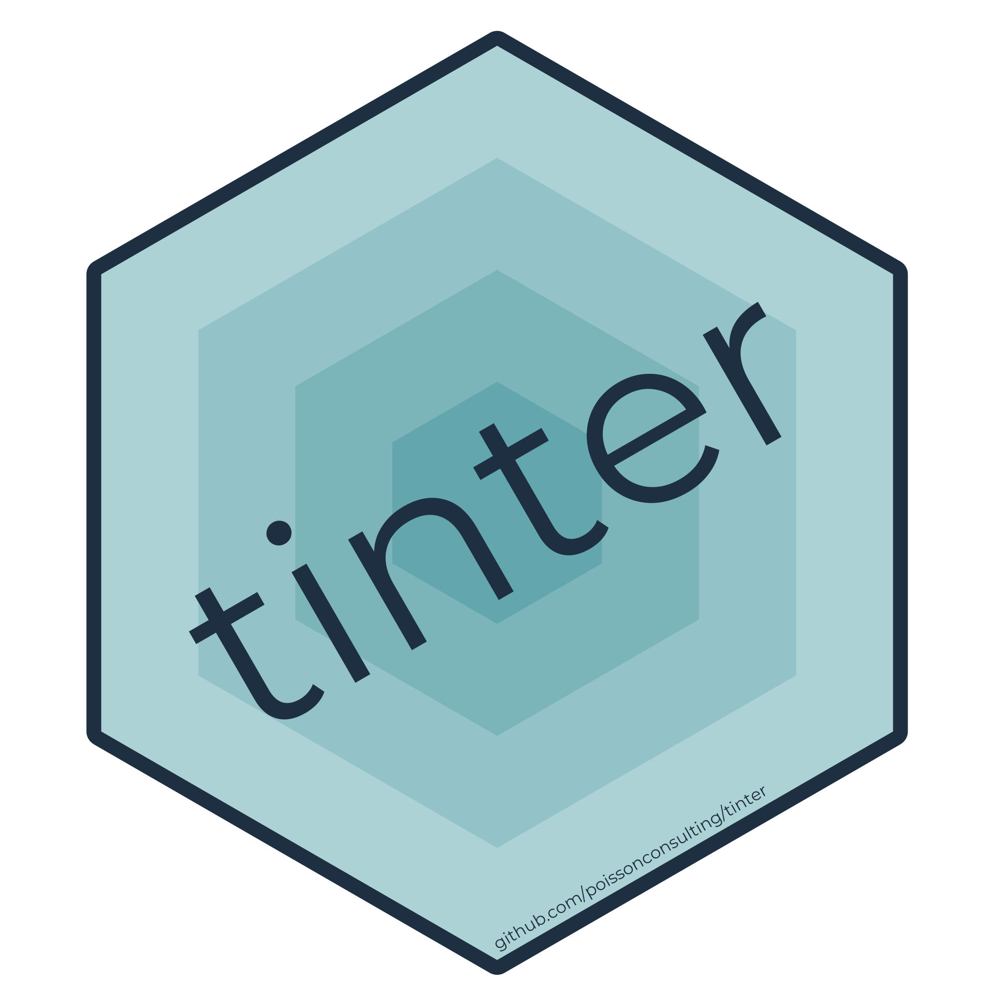

<!-- README.md is generated from README.Rmd. Please edit that file -->

```{r setup, include = FALSE}
knitr::opts_chunk$set(
  collapse = TRUE,
  comment = "#>",
  fig.path = "man/figures/README-",
  fig.width=2, fig.height=0.5
)
```

# tinter 

[](https://www.tidyverse.org/lifecycle/#maturing)
[](https://travis-ci.org/poissonconsulting/tinter)
 [](https://ci.appveyor.com/project/poissonconsulting/tinter)
 [](https://codecov.io/github/poissonconsulting/tinter?branch=master)
[](https://opensource.org/licenses/MIT)
[](https://cran.r-project.org/package=tinter)

### Introduction  
`tinter` provides a simple way to generate monochromatic palettes. Easily define: 

+ palette direction ("shades", "tints", or "both"). 
+ number of colours to generate on either side (`steps`). 
+ number of colours to remove from extreme end(s) of palette (e.g. default `crop = 1` eliminates black and white).    


```{r global}
library(tinter)
hex <- "#fa6a5c"

```

```{r colour, echo = FALSE}
tinter_plot <- function(x){
  grid <- c(length(x), 1)
  width <- 0.9/(max(grid) + 1)
  gap <- 1/(max(grid) + 1)
  centres <- lapply(grid, function(i) gap * ((max(grid) -
                                                i)/2 + seq_len(i)))
  centres <- as.matrix(expand.grid(centres))
  oldPars <- graphics::par(mai = c(0, 0, 0, 0), bg = "white")
  on.exit(graphics::par(oldPars))
  devSize <- grDevices::dev.size()
  devRatio <- devSize[2]/devSize[1]
  graphics::plot(NA, NA, xlim = c(-0.1, 1.1), ylim = 0.5 + c(-1, 1) *
         devRatio * 0.6, xlab = "", ylab = "", xaxt = "n", yaxt = "n",
       bty = "n", asp = 1)
  graphics::rect(centres[, 1] - width/2, rev(centres[, 2]) - width/2,
       centres[, 1] + width/2, rev(centres[, 2]) + width/2,
       col = x, border = "white", lwd = 0.2)
}

tinter_plot(hex)
```

```{r}
tinter(hex)
```

```{r tinter, echo=FALSE}
tinter_plot(tinter(hex))
```

```{r, results="hide"}
tinter(hex, direction = "tints")
```

```{r tints, echo=FALSE}
tinter_plot(tinter(hex, direction = "tints"))

```

```{r, results="hide"}
tinter(hex, steps = 10)
```

```{r steps, echo=FALSE}
tinter_plot(tinter(hex, steps = 10))
```

```{r, results="hide"}
tinter(hex, steps = 10, crop = 7)
```

```{r crop, echo=FALSE}
tinter_plot(tinter(hex, steps = 10, crop = 7))
```
 
### Create a choropleth map

```{r plot, fig.height = 4, fig.width = 8, message=FALSE, warning=FALSE, results="hide"}
library(ggplot2)
library(sf)

nc <- st_read(system.file(package = "sf", "shape/nc.shp"))

ggplot(data = nc) +
  geom_sf(aes(fill = AREA), colour = "white", lwd = 0.05) +
  # colours from tinter
  scale_fill_gradientn(colours = tinter(hex)) +
  theme_void() +
  coord_sf(datum = NA)
```

### Doesn't this already exist?
`tinter` just simplifies a task usually done with `grDevices`.  It's default is to remove black and white from the palette.  

```{r}
tinter("blue")

### ------ is identical to

grDevices::colorRampPalette(colors = c("white", "blue", "black"))(11)[-(c(1, 11))]
```

```{r}
tinter("blue", direction = "shades")

### --- is identical to

grDevices::colorRampPalette(colors = c("blue", "black"))(6)[-6]
```


```{r}
tinter("blue", crop = 2)

### --- is identical to

grDevices::colorRampPalette(colors = c("white", "blue", "black"))(11)[-(c(1:2, 10:11))]
```

## Installation

To install the latest development version from [GitHub](https://github.com/poissonconsulting/tinter)
```
install.packages("devtools")
devtools::install_github("poissonconsulting/err")
devtools::install_github("poissonconsulting/checkr")
devtools::install_github("poissonconsulting/tinter")
```

To install the latest development version from the Poisson drat [repository](https://github.com/poissonconsulting/drat)
```
install.packages("drat")
drat::addRepo("poissonconsulting")
install.packages("tinter")
```

## Contribution

Please report any [issues](https://github.com/poissonconsulting/tinter/issues).

[Pull requests](https://github.com/poissonconsulting/tinter/pulls) are always welcome.

Please note that this project is released with a [Contributor Code of Conduct](CONDUCT.md). 
By participating in this project you agree to abide by its terms.
