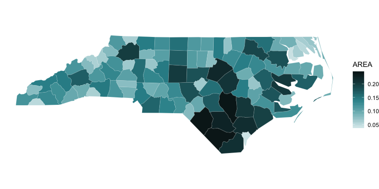

<!-- README.md is generated from README.Rmd. Please edit that file -->

# tinter 

<!-- [](https://www.tidyverse.org/lifecycle/#experimental) -->

<!-- [](https://travis-ci.org/sebdalgarno/tinter) -->

<!--  [](https://ci.appveyor.com/project/sebdalgarno/tinter) -->

<!--  [](https://codecov.io/github/sebdalgarno/tinter?branch=master) -->

<!-- [](https://opensource.org/licenses/MIT) -->

`tinter` is a simple package that solves a simple problem.

From a single colour…

``` r
library(tinter)
hex <- "#1381c2"
```

<!-- -->

create a monochromatic palette *in both directions*…

``` r
tinter(hex)
#> [1] "#CFE5F2" "#A0CCE6" "#71B3DA" "#429ACE" "#1381C2" "#0F679B" "#0B4D74"
#> [8] "#07334D" "#031926"
```

<!-- -->

or just one direction.

``` r
tinter(hex, direction = "shades")
```

<!-- -->

``` r
tinter(hex, direction = "tints")
```

<!-- -->

Adjust number of colours in output.

``` r
tinter(hex, steps = 10)
```

<!-- -->

Adjust number of colours cropped from palette extremes.

``` r
tinter(hex, steps = 10, crop = 7)
```

<!-- -->

Create palette for a choropleth
map.

``` r
ggplot2::ggplot(data = sf::st_read(system.file(package = "sf", "shape/nc.shp"))) +
  ggplot2::geom_sf(ggplot2::aes(fill = AREA), colour = "black", lwd = 0.01) +
  ggplot2::scale_fill_gradientn(colours = tinter(hex))
```

<!-- -->

## Installation

To install the latest development version from
[GitHub](https://github.com/poissonconsulting/tinter)

    install.packages("devtools")
    devtools::install_github("poissonconsulting/err")
    devtools::install_github("poissonconsulting/checkr")
    devtools::install_github("poissonconsulting/tinter")

To install the latest development version from the Poisson drat
[repository](https://github.com/poissonconsulting/drat)

    install.packages("drat")
    drat::addRepo("poissonconsulting")
    install.packages("tinter")

## Contribution

Please report any
[issues](https://github.com/poissonconsulting/tinter/issues).

[Pull requests](https://github.com/poissonconsulting/tinter/pulls) are
always welcome.

Please note that this project is released with a [Contributor Code of
Conduct](CONDUCT.md). By participating in this project you agree to
abide by its terms
